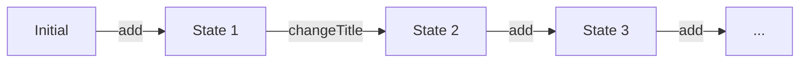

# Deck building

> **Topics**: reducers, actions as data

This section dives a bit more in how we can see a view model from the lenses of an important topic in functional programming: _reducers_ (also known as _folds_, or if you prefer a Greeker word, _catamorphisms_).

Let's look at the components of the `DeckViewModel`:

- An _initial_ state, comprised of `Awesome Deck` as title and an empty list of cards,
- A series of _operations_ (`add`, `changeTitle`, `clear`) which transform this state.

Using these two elements, we can understand the whole lifetime of the application as consecutive steps, each transforming the previous state.



To understand why we call this the _reducer_ model, let's take a small leap of faith, and assume we somehow model the sequence of transformations as a list (no worries, we are making this real in a few paragraphs). Then the _current_ state of the system is define using the `fold` operation over the list of transformations until that point.

```kotlin
val currentState =
  transformationsUntilNow.fold(initialState) { state, transformation ->
    transformation.apply(state)
  }
```

```admonish tldr title="Fold and reduce"

In Kotlin, the difference between `fold` and `reduce` is that in the former you provide an initial state, whereas in the latter the initial state is the first element in the list. But this is not as clear cut in other programming languages. For example, [Redux](https://redux.js.org/) is one of the libraries that popularized this concept in JavaScript.

```

Instead of using methods, we can express each of the available operations as data. We call this technique _actions as data_, or with a fancier term, _reification_. The description of each action should contain enough information to apply the operation to the current state. For our view model, we obtain:

```kotlin
sealed interface DeckOperation {
  data class ChangeTitle(val newTitle: String): DeckOperation
  data class AddCard(val card: Card): DeckOperation
  data object Clear: DeckOperation
}
```

Now our view model can use a single function, and dispatch based on the operation.

```kotlin
class DeckViewModel: ViewModel() {
  fun apply(operation: DeckOperation) = when (operation) {
    is DeckOperation.ChangeTitle -> { ... }
    is DeckOperation.AddCard -> { ... }
    DeckOperation.Clear -> { ... }
  }
}
```

In the tasks below we use this idea to improve the implementation, and introduce new functionality.

```admonish info title="Initial style DSLs"

Actions as data is the beginning of a journey to _domain specific languages_ (DSLs), the idea of introducing a small language to describe your specific domain. In particular, actions as data relate to a particular technique to implement DSLs, called _initial style_. [Inikio](https://serranofp.com/inikio/) is a compiler plug-in to facilitate the development of such DSLs in Kotlin.

```

## Move to actions as data

Your **task** is to finish the conversion of the given code into an actions-as-data-based approach. That is, copy (and extend if necessary) the `DeckOperation` type given above, and change the view model to use a single point of entry `apply` to every transformation.

## Remove a card

Right now the only option the users of Poké-Fun have if they have added a card they do not like is to clear the entire deck 🫠 Your **task** is to implement functionality to _remove_ a card from the deck: this involes changes in _both_ view model and view.

```admonish tip

Take a look at `search/view.kt` to see how to add components to each card shown on the screen.

```

## Undo and redo

One functionality which becomes much easier to implement when operations are reified as data is undo and redo, since you can very easily keep track of what the user has done.

Your **task** is to finish the implementation: the given view contains buttons for the actions, but they do nothing and are never enabled. At the end, the corresponding buttons in the view should only be enabled when there are operations to undo (or redo, respectively).
