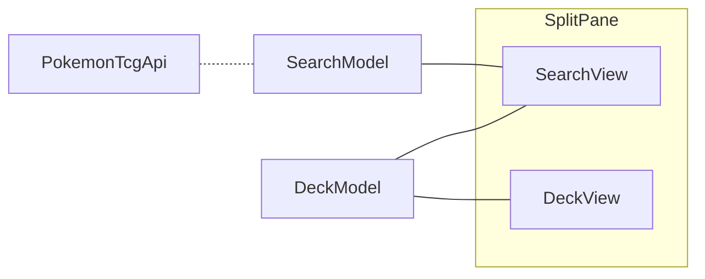

# Introduction

Now that you know about the [domain](./tcg.md) and the [technology](./tech-intro.md), we can describe the given implementation of Poké-Fun.

## Cards

The `tcg` module gives access to cards and their information.

- The `tcg.kt` file defines a set of types that represent the information of a single card, including their name, identifier, category, and type. We shall delve on these types in the [_What is (in) a deck_](./adt.md) section.
- The `api.kt` file implements a service for searching a particular identifier or a set of cards, based on the [Pokémon TCG API](https://docs.pokemontcg.io/). The current implementation is very basic, but after finishing the [_Deal with bad internet_](./resilience.md), we'll have some respectable code.

## General design

The diagram below roughly represents how Poké-Fun is architected.

In the center we find two different view models, which serve different purposes:

- `DeckModel` (in `deck/model.kt`) keeps track of the current status of the deck, including the cards contained in it, and the (potential) problems with that choice of cards.
- `SearchModel` (in `search/model.kt`) keeps track of the state of search, and is responsible for communicating with the [Pokémon TCG API](https://docs.pokemontcg.io/).

Access to the Pokémon TCG API is mediated by the `PokemonTcgApi` interface (in the `tcg/api` folder), for which we give a "real" implementation talking over the network using [Ktor](https://ktor.io), and a "fake" one with a few predefined cards.

Two different views represent the data of the view models in a graphical manner. Those are put together in a single screen using a `SplitPane`, one of the [desktop-specific components](https://github.com/JetBrains/compose-multiplatform/blob/master/tutorials/README.md#desktop) offered by Compose Multiplatform.

- On the left-hand side we have the `SearchView` (in `search/view.kt`), where the users input their search and see results. This view also adds selected cards to the deck, hence the dependence on the `DeckModel`.
- On the right-hand side we have the `DeckView` (in `deck/view.kt`), which simply shows the cards and problems.

Both view make use of common component to show a single `Card` and a list of `Card`s, found in `tcg/cardView.kt`. These components have an `extra` parameter which is used to provide the different elements required in each of the views (for example, the _Add_ button in the search pane).
