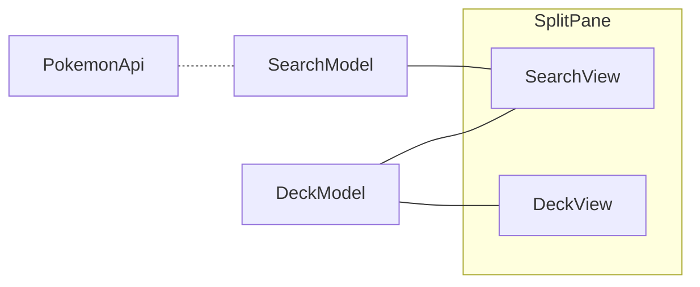

# Introduction

Now that you know about the [domain](./tcg.md) and the [technology](./tech-intro.md), we can describe the given implementation of Poké-Fun.

## Cards

The `tcg` module gives access to cards and their information.

- The `tcg.kt` file defines a set of types that represent the information of a single card, including their name, identifier, category, and type. We shall delve on these types in the [_What is (in) a deck_](./adt.md) section.
- The `api.kt` file implements a service for searching a particular identifier or a set of cards, based on the [Pokémon TCG API](https://docs.pokemontcg.io/). The current implementation is very basic, but after finishing the [_Deal with bad internet_](./resilience.md), we'll have some respectable code.

## Architecture

